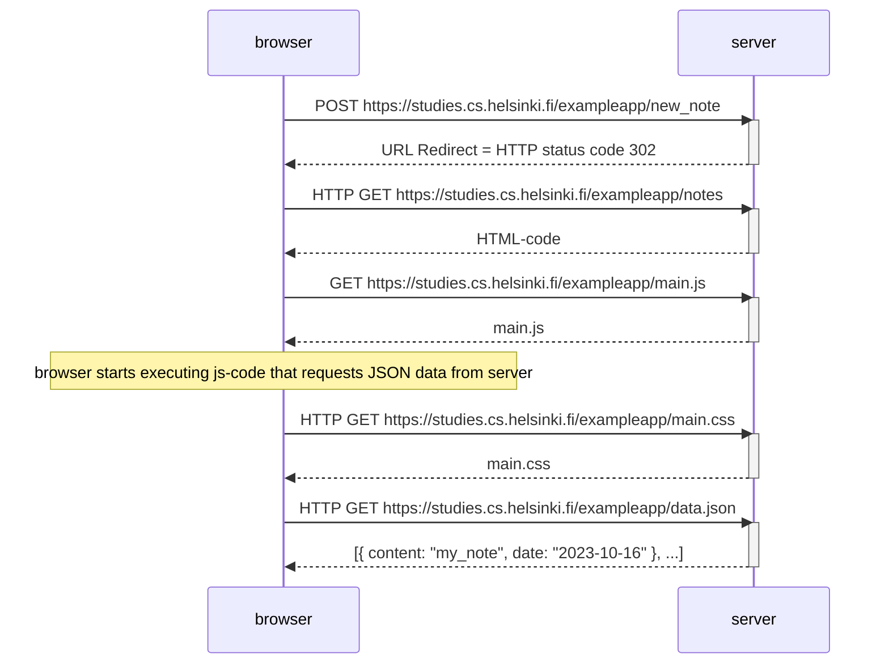

#  Task 0-0.4

```mermaid
sequenceDiagram
    participant browser
    participant server

    browser->>server: POST https://studies.cs.helsinki.fi/exampleapp/new_note

    activate server
    server-->>browser: URL Redirect = HTTP status code 302
    deactivate server

    browser->>server: HTTP GET https://studies.cs.helsinki.fi/exampleapp/notes
    activate server

    server-->>browser: HTML-code
    deactivate server

    browser->>server: GET https://studies.cs.helsinki.fi/exampleapp/main.js
    activate server
    server-->>browser: main.js
    deactivate server
    note over browser:browser starts executing js-code that requests JSON data from server 

    browser->>server: HTTP GET https://studies.cs.helsinki.fi/exampleapp/main.css
    activate server
    server-->>browser: main.css
    deactivate server

    browser->>server: HTTP GET https://studies.cs.helsinki.fi/exampleapp/data.json
    activate server
    server-->>browser: [{ content: "my_note", date: "2023-10-16" }, ...]
    deactivate server
```  