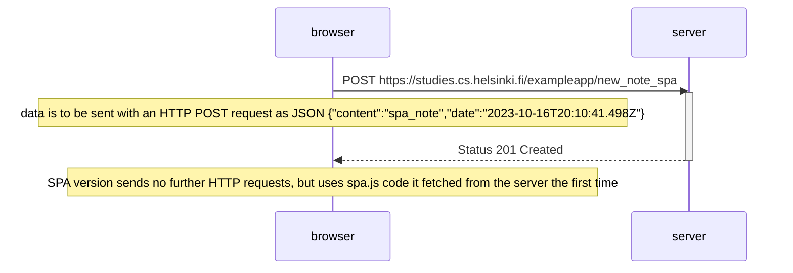

#  Task 0-0.6

```mermaid
sequenceDiagram
    participant browser
    participant server

    browser->>server: POST https://studies.cs.helsinki.fi/exampleapp/new_note_spa

     activate server

    note over browser :data is to be sent with an HTTP POST request as JSON {"content":"spa_note","date":"2023-10-16T20:10:41.498Z"}

    server-->>browser: Status 201 Created 
    deactivate server

    note over browser : SPA version sends no further HTTP requests, but uses spa.js code it fetched from the server the first time
```
    